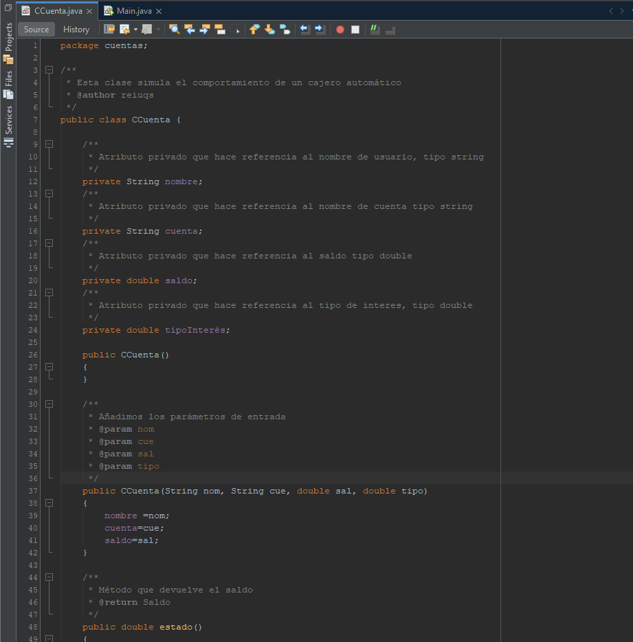
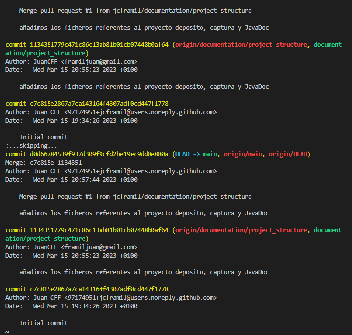

# Tarea_UD04_DAM

## Motivación

Este repositorio tiene como objetivo contener el código de la tarea de la unidad04 de entornos de desarrollo.

## Estructura

En este repositorio encontraremos los siguientes ficheros:

- [proyecto Java deposito](deposito)
- [JavaDoc](deposito/dist/javadoc/index.html)
- [Captura de comentarios](comments_deposito.png)

- [Captura de versiones con `git log`](git_log.png)

